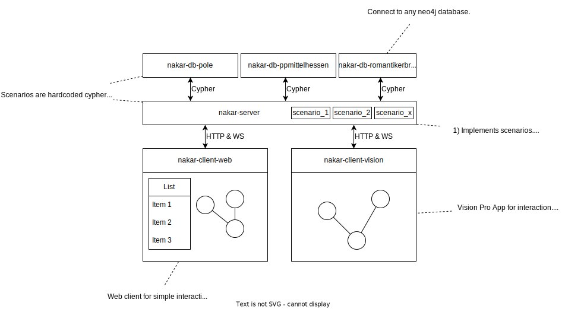

# Navigation and Exploration of Knowledge Graphs in Augmented Reality (NAKAR)

User-centered serendipitous discoveries

## Contribution Guide

1. Start the POLE database (nakar-db-pole)
1. Start the server (nakar-server)
1. Start the web application (nakar-client-web)

## Architecture

